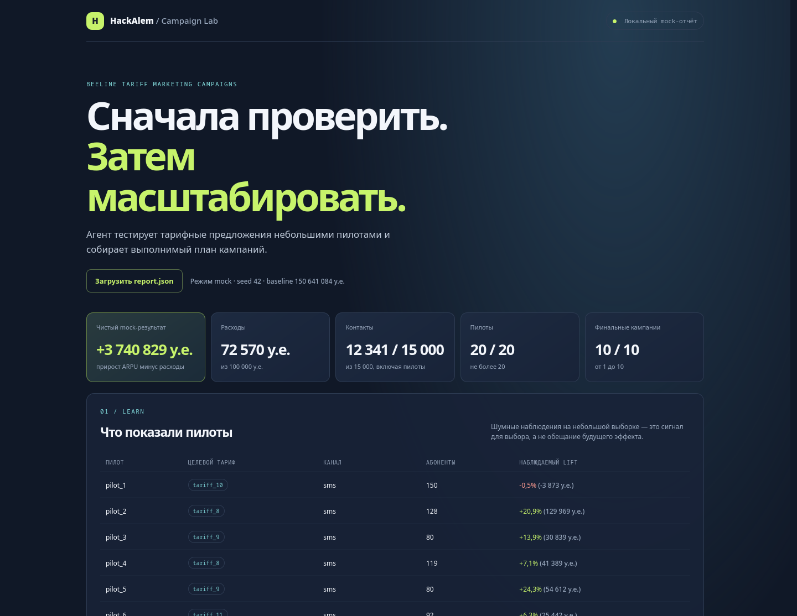

<div align="center">

# Beeline Tariff Campaign Agent

**От исторических данных — к проверенным пилотами тарифным кампаниям.**

HackAlem · Beeline Tariff Marketing Campaigns<br>
Python 3.12 · Автономный запуск · Воспроизводимый результат

[Быстрый запуск](#быстрый-запуск) · [Проверка решения](#проверка-решения) · [Результаты](#результаты) · [Демонстрация](#демонстрация) · [Документация](docs/README.md)

</div>

---

## Задача и решение

Каким абонентам предложить новый тариф, через какой канал и в каком порядке, чтобы дополнительная выручка превысила расходы на коммуникации?

Наш агент решает эту задачу для **23 441 абонента и 21 тарифа**. Он формирует гипотезы по истории переходов, проверяет их небольшими пилотами и распределяет оставшийся бюджет между финальными кампаниями. Результаты пилотов влияют на дальнейшее исследование и итоговый выбор.

**Точка входа:** [`Agent.act(env)`](agent.py). **Результат:** от 1 до 10 кампаний и воспроизводимый [`submission.csv`](submission.csv). Актуальная версия находится в ветке **`main`**.

> Все данные и эффекты в задании синтетические. Приведённые ниже результаты относятся к локальной учебной среде и не гарантируют балл на скрытом судействе.

## Быстрый запуск

Нужен **Python 3.12**. Все команды выполняются из корня проекта. API-ключи, GPU и внешние сервисы не нужны; после установки зависимостей агент работает без интернета.

**1. Получите проект и создайте окружение**

```bash
git -c core.autocrlf=false clone https://github.com/BAITC-Hacks/hack-575ea89d-team.git
cd hack-575ea89d-team
python -m venv .venv
```

`core.autocrlf=false` сохраняет исходные байты организаторских файлов, в том числе на Windows. Если Python доступен как `python3`, используйте это имя при создании окружения.

**2. Активируйте окружение**

Linux / macOS:

```bash
source .venv/bin/activate
```

Windows PowerShell:

```powershell
.\.venv\Scripts\Activate.ps1
```

**3. Установите зависимости и запустите оценку**

```bash
python -m pip install -r requirements.txt
python local_eval.py
```

Ожидается `Статус: PASS`, 20 пилотов и 10 финальных кампаний на стандартном seed 42. Числа этого запуска приведены в разделе «Результаты».

## Проверка решения

| Что проверить | Команда | Подтверждённый результат |
|---|---|---|
| Официальный локальный прогон | `python local_eval.py` | PASS на seed 42 |
| Устойчивость на десяти seed | `python local_eval.py --runs 10` | 10 из 10 положительных результатов |
| Контракты, данные, исследования и отчёт | `python -m unittest discover -s tests -v` | 40 тестов прошли |
| Пилоты, выбор кампаний и граничные случаи | `python -m unittest strategy.test_planner strategy.test_portfolio strategy.test_stress -v` | 17 тестов прошли |
| Генерация файла сдачи | `python make_submission.py` | 10 кампаний; повторная генерация даёт те же байты |
| Логика демонстрации, при наличии Node.js | `node demo/app.test.js` | 5 сценариев прошли |

Проверки общей сборки выполнены на Linux, Python 3.12, numpy 2.5.3 и pandas 2.3.3. JS-сценарии также вызываются одним из общих тестов; без Node.js этот дополнительный тест пропускается. Node.js не нужен самому агенту.

[Итоговый протокол](docs/FINAL_VALIDATION.md) · [Сырые журналы проверок](docs/final_validation/) · [Проверка демо в Firefox](docs/VALIDATION.md)

## Как агент принимает решения


1. **Выдвигает гипотезы.** `research/candidates.py` учитывает историю переходов, ценность сегмента и соответствие тарифа потреблению. Исторические изменения среди уже сменивших тариф используются для ранжирования, а не как измеренная конверсия кампании.
2. **Проверяет пилотами.** `strategy/planner.py` выбирает размер выборки, повторный замер, альтернативный тариф или другой канал. Наблюдения усредняются с учётом размера пилота; неопределённость помогает выбирать следующую проверку.
3. **Сохраняет ресурсы для результата.** Перед новым пилотом резервирует финальный план. Исследование ограничено числом пилотов, контактами и бюджетом; при недостатке средств на первый платный пилот рассматривается более дешёвый канал.
4. **Собирает портфель кампаний.** Сравнивает несколько жадных вариантов, затем `strategy/portfolio.py` проверяет ограниченное число замен, добавлений и удалений. Учитывает дополнительный эффект, стоимость, порядок и пересечения аудиторий. В финал попадают только проверенные пары «тариф–канал».

При плохих наблюдениях агент сохраняет допустимый проверенный вариант с наименьшим ожидаемым убытком. Положительная прибыль не гарантируется. Технические детали: [стратегия](strategy/README.md), [исследования](docs/RESEARCH.md), [контракт модулей](docs/API_CONTRACT.md).

## Результаты

**Последняя общая сборка, официальный локальный оценщик, seed 42:**

| Показатель | Значение |
|---|---:|
| Дополнительная выручка до расходов | +3 813 399 у.е. |
| Расходы на коммуникации | 72 570 у.е. |
| **Чистый дополнительный результат** | **+3 740 829 у.е.** |
| Контакты, включая пилоты и повторы | 12 341 |
| Пилоты / финальные кампании | 20 / 10 |
| Самая большая финальная аудитория | 4 726 абонентов |

**Серия seed 0–9:** медиана **3 760 624**, минимум **2 934 502**, максимум **4 231 176** у.е.; все 10 прогонов положительные.

В ранее проведённом сравнении полного агента с исходным baseline медиана на seed 0–9 выросла с 3 178 575 до 3 760 624. На seed 30–39 улучшились 8 из 10 результатов; ухудшения на seed 32 и 34 сохранены в [истории экспериментов](docs/AGENT_VALIDATION.md). Последнее уточнение портфеля не изменило результаты на seed 0–9 и 42; его польза отдельно проверена на искусственных контрпримерах жадного выбора.

Исследование трёх генераторов при фиксированном planner — **отдельный эксперимент с другой базой сравнения**. Его результаты, ограничения и проигрыши доступны в [исследовательском отчёте](docs/RESEARCH.md).

## Ограничения задачи

| Ограничение | Лимит |
|---|---:|
| Финальные кампании | 1–10 |
| Абоненты на одну кампанию | ≤ 5 000 |
| Контакты, включая пилоты и повторы | ≤ 15 000 |
| Общий бюджет | ≤ 100 000 у.е. |
| Пилоты | ≤ 20, по 10–200 человек |

Эффект на абонента засчитывается один раз по лучшей кампании, а каждый повторный контакт расходует ресурсы. Планировщик учитывает оба условия. Исходные CSV, среда и официальный скоринг сохранены без изменений; их целостность проверяется по [SHA256-манифесту](docs/organizer_manifest.json).

Оценка неопределённости эвристическая, локальный поиск не гарантирует глобальный оптимум. Пересечения с пилотами оцениваются приближённо: публичный API не раскрывает ID участников пилотов. Агент использует публичный интерфейс среды; результаты официального оценщика не передаются в его решения.

## Демонстрация

Сначала сформируйте отчёт, затем запустите локальный сервер:

```bash
python tools/report.py --seed 42
python -m http.server 8000 --bind 127.0.0.1
```

Откройте **[http://localhost:8000/demo/](http://localhost:8000/demo/)**. На странице отдельно показаны наблюдения пилотов, финальные кампании и метрики локальной оценки. Отчёт `artifacts/report.json` загружается автоматически; его также можно выбрать кнопкой «Загрузить report.json».



Скриншот из проверки ноутбука 3. [Браузерные проверки и ограничения](docs/VALIDATION.md) · [Краткий текст защиты](docs/PITCH.md)

## Структура проекта

| Путь | Назначение |
|---|---|
| [`agent.py`](agent.py) | Точка входа `Agent.act(env)` |
| [`strategy/`](strategy/) | Адаптивное исследование, выбор и уточнение кампаний |
| [`research/candidates.py`](research/candidates.py) | Гипотезы из публичных данных |
| [`research/experiments/`](research/experiments/) | Сохранённые исследовательские результаты и их происхождение |
| [`tests/`](tests/) | Контрактные проверки и тесты исследований |
| [`tools/report.py`](tools/report.py), [`demo/`](demo/) | Отчёт локального оценщика и демонстрация |
| [`data/`](data/), корневые CSV | Данные организаторов |
| [`local_eval.py`](local_eval.py), [`make_submission.py`](make_submission.py) | Официальные инструменты проверки и генерации CSV |
| [`submission.csv`](submission.csv) | Сгенерированные финальные кампании |
| [`docs/`](docs/README.md) | Описание решения, доказательства проверок и материалы защиты |

## Состав сдачи

Передавайте **весь проект**: `agent.py` импортирует `strategy/planner.py`, `strategy/portfolio.py` и `research/candidates.py`; для построения гипотез нужен `data/change_tariff.csv`. В репозитории также есть зависимости, официальный оценщик, исходные данные и `submission.csv` для воспроизведения. Один `agent.py` без модулей недостаточен.

Файл `submission.csv` создан официальным генератором и проверен двумя последовательными запусками. SHA256:

```text
386245e3037b13ac23ad2271e407f88e2e6954c05f37d00bff753b8888b99e8e
```

Формат модульной упаковки требует подтверждения организаторов. В руководстве указан лимит 10 минут, в комментарии шаблона — 5 минут; локальные проверки укладываются в оба. [Уточнения по условиям](docs/JUDGING.md).

---

[Руководство организаторов](PARTICIPANT_GUIDE.md) · [Навигация по документации](docs/README.md) · [Текущий статус](STATUS.md)
